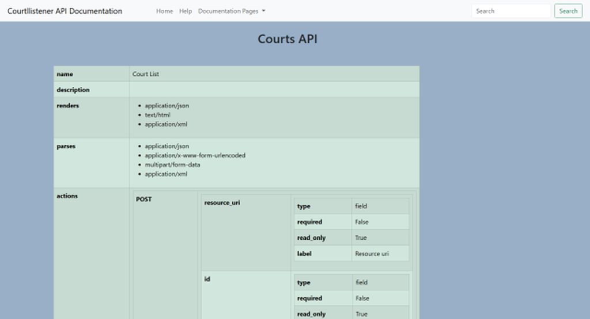

#### CourtListener API Documentation Help  
 This project provides a set of HTML files derived from from the CL APIs options requests.
 The API json has been translated into easy to read HTML tables.  
 
 ##### Sample Content
   
 
 This is partial screen shot of the courts API page.  
 The table consists of "nested" tables of the JSON objects.  
 The first 2 entrys are simple key/value pairs so they make single rows in the main table.  
 The next item - renders - is a list of the HTTP types the API can render as responses to an API request. It still occupies only a single row. The "parses" element is the same type.  
   
   The next item - actions - is more complex. It has a child element named "POST" which contains a long list of different elements. It is many screens long. As a result, the actions
   makes a table containinf the POST table containing myriad smaller elements. The borders around the elements should be helpful visually to understand the structure.  
   
   ##### The Navbar:  
   Each page contains the same navbar with the folloowing features:  
   1. ***Home*** takes you to the project home page.
   1. ***Help*** brings you to this page.
   1. ***Documentation Pages*** is a dropdown containing links to all of the other pages.
   1. ***Search within the page*** impements a full text search of the page content:  
		1. Type the word or string you want to find in the box labeled "Search."
		1. Click the "Search" button. If, your text is in the page, it will scroll to and select the first ocurrance. Subsequent clicks go to subsequent ocurrances until it wraps back around to your typed entry.

  
   
 